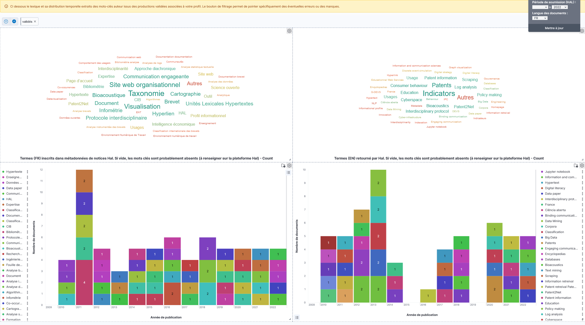

Guide de l'utilisateur
========================

SoVisu est fait pour accompagner l'auto-archivage des travaux de publication. Il permet de situer l'état de ses publications (sont elles présentes, ouvertes, les fichiers complets peuvent ils être déposés ?). SoVisu construit de surcroît leur représentation lexicales dans les index (quels sont les mots qui permettent de retrouver mes productions ?) en anglais et en français. Ceci s'effectue en quelques clics.
Les informations renseignées dans votre profil vous aideront par la suite à compléter et étendre cette représentation lexicale en vous suggérant de nouveaux mots-clés.
Après authentification, SoVisu vous dirige vers la vérification des données de votre profil.

Vérification des données
------------------------

Identifiants
^^^^^^^^^^^^
Partie incontournable pour entrer du bon pied dans la science ouverte. Vous rapportez vos `IdRefs <https://www.idref.fr/>`_, `IdHal <https://doc.archives-ouvertes.fr/identifiant-auteur-idhal-cv/>`_ , `OrcId <https://orcid.org/>`_ (à créer le cas échéant).

.. warning::
  Si les identifiants rapportés sont faux rien de ce qui suit ne fonctionnera.

.. image:: images/Ids.png
    :width: 800px
    :align: center
    :alt: formulaire de demande d'ids

.. note::
:class: dropdown
Le formulaire peut aisément intégrer d'autres Is (scopusId, researcherId...)

Notices
^^^^^^^
Vous affiche la liste de vos publications et votre position d'auteur (que vous pouvez modifier à l'aide du bouton "Mise à jour de l'autorat", si mal calculée). Vous pouvez éventuellement retirer de votre profil celles que vous considérez comme marginales avec l'autre bouton. Celle-ci basculera dans le volet des notices retirées. Au plus les productions sont en phase avec votre expertise au mieux le lexique issus de ces dernières ciblera votre profil dans le moteur de recherches.

.. tip::
  Si vous avez récemment modifié, le bouton "Collecter (ou mettre à jour) de nouvelles références" permet de re-télécharger les notices associées à votre idhal.

Expertise
^^^^^^^^^
Cet onglet vous permet de sélectionner les domaines scientifiques issus par calcul de votre production. Vous pouvez en retirer de votre profil pour ne conserver que celles qui représentent le mieux vos travaux. Au mieux ces éléments cernent votre expertise au plus les enrichissements seront pertinents.

Domaines
^^^^^^^^
Même principe que précédemment. L'interface vous permet de sélectionner dans la nomenclature `AureHAL <https://aurehal.archives-ouvertes.fr/domain/index>`_ le ou les domaines de vos travaux. Encore une fois, au mieux ces domaines décrivent votre expertise au plus les enrichissements seront pertinents.

.. tip::
  Le menu déroulant vous permet de parcourir l'arborescence des domaines disciplinaires pour y sélectionner les noeuds les plus adéquats. N'oubliez pas de valider.

Descriptifs de recherche
^^^^^^^^^^^^^^^^^^^^^^^^
Dans cet onglet vous devez renseigner les mots-clés génériques de votre expertise.

.. image:: images/Descriptifs.png
    :width: 800px
    :align: center
    :alt: onglet domaines

Les autres champs permettent de spécifier vos projets, travaux, etc.

.. note::
:class: dropdown
  Ces derniers sont non utilisés dans cette version.

Synthèses
---------

Tableau de bord
^^^^^^^^^^^^^^^
Différentes cartographies de vos publications. Le commutateur validé permet d'inclure ou pas vos productions que vous auriez invalidées. Le baromètre de vos publications vous donne la tendance d'ouverture fonctions de vos choix d'éditeurs. Si la courbe indécidable diminue, que la courbe ouvert augmente, continuez vous êtes sur la bonne voie !

Références
^^^^^^^^^^
Permet d'afficher vos publications en trois rubriques : les notices qui mériteraient d'être complétées (champs manquants), celles qui sont complètes et l'ensemble de vos publications (hors celles retirées volontairement). Le dispositif souligne également si la publication complète peut être archivée avec le texte complet (en fichier pdf ou autre) : notez qu'il convient toujours de demander aux co-auteurs bien sûr, mais les conditions juridiques par rapport aux éditeurs ont, dans ce cas, été levées. Un score de 0 à 100 attribue une note à ces métadonnées, clés du référencement et de l'indexation pour vous inciter à améliorer ce point.

Façonner sa représentation lexicale
------------------------------------

Lexiques extraits
^^^^^^^^^^^^^^^^^^

SoVisu vous affiche la représentation lexicale de vos travaux en deux langues à partir des mots-clés des notices et sa distribution historique.

Sélecteur de langues
^^^^^^^^^^^^^^^^^^^^^

Le sélecteur des langues vous permet de filtrer sur une langue en particulier. Sélectionnez et mettez à jour.

Interface d'une langue
^^^^^^^^^^^^^^^^^^^^^^

Vous avez alors accès à une représentation plus complète dans la langue choisie :

1. les mots clés auteurs, ceux qui sont présents sur les notices. Les notices sans mots-clés sont marquées "manquants",
2. à droite des précédents, les mots extraits automatiquement des résumés à partir du service de l'inist `term-extraction <https://objectif-tdm.inist.fr/2021/12/20/extraction-de-termes-teeft/>`_
3. En bas à gauche de l'interface, les entités nommées identifiées (dates, noms propres, lieux) par traitement des résumés à l'aide d'outils de traitement automatique du langage (`Spacy <https://spacy.io/>`_)
4. Vos références avec un lien pour éditer la notice directement sur HAL (il faudra vous authentifier la première fois).

Mode opératoire suggéré
^^^^^^^^^^^^^^^^^^^^^^^

Grâce à cette interface, vous pourrez modifier la représentation lexicale de vos travaux, appuyer  certains termes (par synonymie), en rajouter d'autres. A terme, SoVisu vous suggèrera d'apposer d'autres termes. En sélectionnant les manquants vous filtrez les notices qui n'auraient pas de mots-clés ou celles sans résumés (celles ci sont moins *lisibles*). En sélectionnant des termes qui vous paraissent étranges, vous ciblez les notices dont sont extraits ces termes. Chaque fois, la sélection provoque une mise à jour du filtre de requête en haut à gauche de l'interface que vous pouvez supprimer (la croix) pour revenir en arrière.

.. tip:: N'hésitez pas non plus à déposer le texte complet (pdf), mais n'oubliez pas de renseigner mots-clés et résumés utilisés par les index pour appuyer votre référencement.
